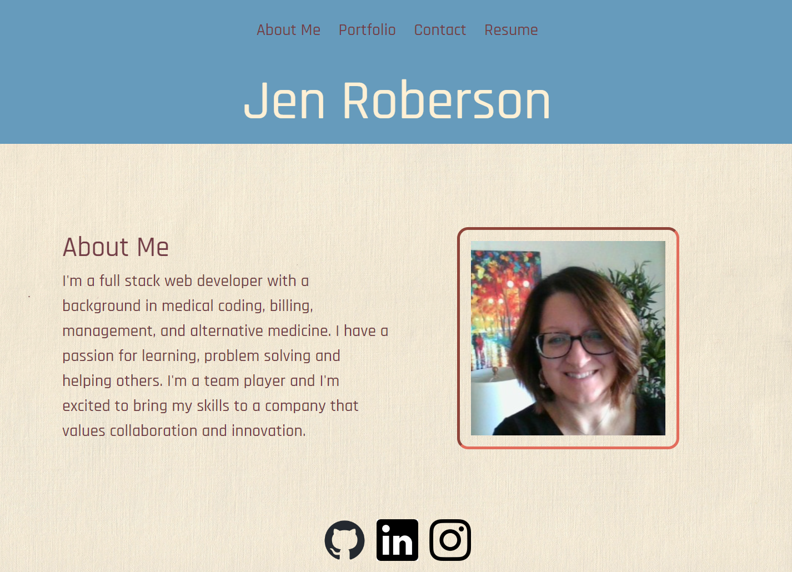

# Jen's Portfolio

## Description

This is a portfolio website that showcases my work as a web developer and is built with React and Bootstrap. It contains pages for an About Me section, a Portfolio section, a Contact section and a Resume section. The About Me section contains a brief bio and a photo of me. The Portfolio section contains links to my projects. The Contact section contains a form for visitors to fill out if they would like to contact me a the Resume section contains a link to download my resume and a list of acquired skills.

## Table of Contents

* [Installation](#installation)
* [Usage](#usage)
* [License](#license)
* [Screenshot](#screenshot)
* [Link to deployed application](#link-to-deployed-application)

## Installation

To install this application, clone the code into your terminal. Install the dependencies by running `npm install` in your terminal. Then run `npm start` to start the application.

## Usage

This app is used to create my portfolio.

## License

## Screenshot

## Link to deployed application

https://jrob02180.github.io/jens-portfolio/